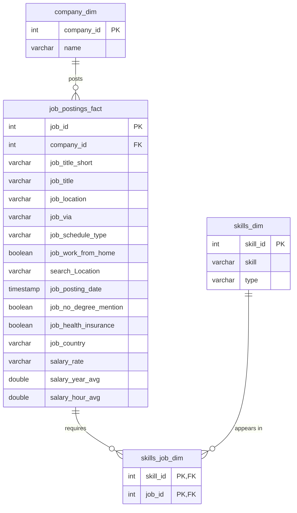

# Job Market Data Warehouse

An end-to-end SQL data warehouse project built with **DuckDB**. It takes raw job postings data, models it into a **star schema**, and builds a **flat mart** for analysis. The whole pipeline runs with a single command.

This is my first analytics engineering project, built while moving from data analyst to analytics engineer.

---

## Table of Contents

1. [Project Goal](#project-goal)
2. [Tech Stack](#tech-stack)
3. [Architecture](#architecture)
4. [Data Model](#data-model)
5. [Project Structure](#project-structure)
6. [Pipeline Steps](#pipeline-steps)
7. [How to Run](#how-to-run)
8. [Example Analysis](#example-analysis)
9. [Design Decisions](#design-decisions)
10. [What I Learned](#what-i-learned)
11. [Roadmap](#roadmap)
12. [Author](#author)

---

## Project Goal

Raw job postings data is spread across several CSV files and is hard to analyze directly. The goal of this project is to:

- Model the data into a clean **star schema** (facts and dimensions)
- Load it reliably and repeatably from cloud-hosted CSV files
- Build a **flat mart** so analysts can answer questions without writing multi-table joins
- Automate the full build with one script

Questions the final model helps answer:

- Which skills are most in demand for each job title?
- Which skills are linked to higher salaries?
- How do salaries compare for remote vs. on-site jobs?
- Which companies post the most jobs?

## Tech Stack

| Tool | Use |
|---|---|
| DuckDB | Analytical database and SQL engine |
| SQL | Schema design, loading, transformation |
| Google Cloud Storage | Hosts the source CSV files |
| Git / GitHub | Version control |

## Architecture

```
┌──────────────────────┐
│  Source CSV files    │   company, skills, job postings, job-skill links
│  (cloud storage)     │
└──────────┬───────────┘
           │  read_csv (AUTO_DETECT)
           ▼
┌──────────────────────┐
│  Data Warehouse      │   Star schema:
│  (star schema)       │   1 fact table, 2 dimensions, 1 bridge table
└──────────┬───────────┘
           │  JOIN + ARRAY_AGG
           ▼
┌──────────────────────┐
│  flat_mart.job_mart  │   One row per job, skills nested in an array
└──────────────────────┘
```

## Data Model

### Star schema



| Table | Type | Description |
|---|---|---|
| `company_dim` | Dimension | Companies that posted jobs |
| `skills_dim` | Dimension | Skills and their category (e.g. programming, cloud) |
| `job_postings_fact` | Fact | One row per job posting with salary, location, schedule, and benefit flags |
| `skills_job_dim` | Bridge | Resolves the many-to-many link between jobs and skills |

### Flat mart: `flat_mart.job_mart`

A denormalized table with **one row per job**. It combines the fact table with company details and packs every skill for the job into one column, `Skill_and_Type`, an array of `{type, name}` structs.

## Project Structure

```
.
├── 1_create_tables_dw.sql     # Create the star schema tables
├── 2_load_schema_dw.sql       # Load CSV data and verify row counts
├── 3_create_flat_mart.sql     # Build flat_mart.job_mart
├── build_dw_marts.sql         # Master script: runs steps 1 to 3
└── README.md
```

## Pipeline Steps

**1. Create tables** (`1_create_tables_dw.sql`)
Drops old tables in dependency order (bridge, fact, dimensions), then creates them with primary and foreign keys. Safe to re-run.

**2. Load data** (`2_load_schema_dw.sql`)
Reads each CSV straight from its URL with `read_csv(..., AUTO_DETECT = TRUE)` and loads tables in dependency order. Maps the source column `job_posted_date` to `job_posting_date`. Finishes with a `UNION ALL` row count check on every table.

**3. Build the flat mart** (`3_create_flat_mart.sql`)
Creates the `flat_mart` schema and builds `job_mart` by `LEFT JOIN`ing the fact table to the company, bridge, and skills tables. `ARRAY_AGG(STRUCT_PACK(...))` collapses each job's skills into one array, and `GROUP BY ALL` handles the grouping. Ends with a row count check.

**4. Orchestrate** (`build_dw_marts.sql`)
Uses DuckDB's `.read` command to run all three scripts in order.

## How to Run

1. Install [DuckDB](https://duckdb.org/docs/installation/).
2. Clone this repo and open a terminal in the project folder.
3. Build the whole warehouse:

```bash
duckdb dw_marts.duckdb -c ".read build_dw_marts.sql"
```

4. Open the database and explore:

```bash
duckdb dw_marts.duckdb
```

> The `.read` command works in the DuckDB command-line tool, not in most GUI clients.

**Sanity check:** the row count of `flat_mart.job_mart` should equal the row count of `job_postings_fact`.

## Example Analysis

**Top 10 skills for Data Analyst jobs (from the flat mart):**

```sql
WITH job_skills AS (
    SELECT
        job_title_short,
        UNNEST(Skill_and_Type) AS s
    FROM flat_mart.job_mart
)
SELECT
    s.name AS skill,
    COUNT(*) AS demand_count
FROM job_skills
WHERE job_title_short = 'Data Analyst'
  AND s.name IS NOT NULL
GROUP BY s.name
ORDER BY demand_count DESC
LIMIT 10;
```

**Average yearly salary: remote vs. on-site:**

```sql
SELECT
    job_work_from_home,
    COUNT(*) AS jobs,
    ROUND(AVG(salary_year_avg)) AS avg_yearly_salary
FROM flat_mart.job_mart
WHERE salary_year_avg IS NOT NULL
GROUP BY job_work_from_home;
```

## Design Decisions

- **Star schema first, mart second.** The warehouse stays clean and reusable, and the mart is a convenience layer that can be dropped and rebuilt at any time.
- **Bridge table for skills.** A job needs many skills and a skill appears in many jobs, so a separate table avoids duplicating fact rows.
- **Array of structs in the mart.** Keeps one row per job while preserving each skill's name and type.
- **Idempotent scripts.** Dropping and recreating objects means the pipeline can be re-run at any time with the same result.
- **Explicit column lists on insert.** Protects the load from column order changes in the source files.
- **Single entry point.** One master script makes the build reproducible for anyone who clones the repo.

## What I Learned

- Designing a star schema and choosing the grain of a fact table
- Handling many-to-many relationships with a bridge table
- Loading data directly from cloud URLs with DuckDB
- Working with nested types (`ARRAY_AGG`, `STRUCT_PACK`, `UNNEST`)
- Ordering scripts by dependency and making them re-runnable
- Validating loads with row count checks

## Roadmap

- [ ] Add a folder of analysis queries (skills demand, salary by skill, trends over time)
- [ ] Add data quality checks (nulls, duplicates, orphaned foreign keys)
- [ ] Rebuild the pipeline in **dbt** (staging, marts, tests, documentation)
- [ ] Add CI with GitHub Actions to run the build on every push
- [ ] Connect a dashboard (Power BI, Tableau, or Metabase) to the mart

## Data Source

Public CSV files hosted at `https://storage.googleapis.com/sql_de/`.

## Author

**Mohamed Hassan**  
[LinkedIn](https://www.linkedin.com/in/mohamed-hassan-167371298/)
